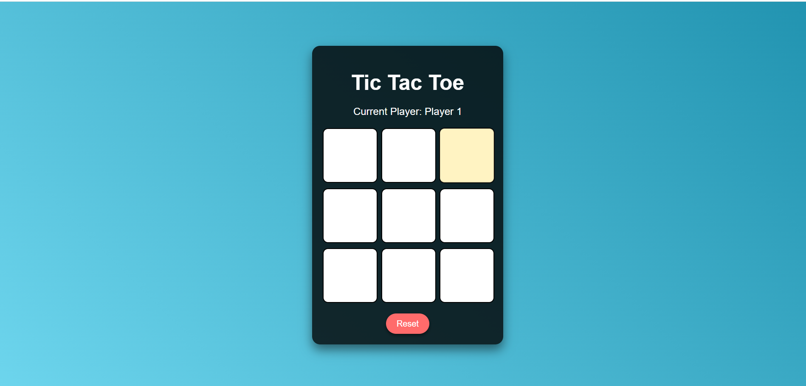

# Tic Tac Toe Game

### **Project Overview**  
This is a simple and interactive **Tic Tac Toe** game built using **HTML**, **CSS**, and **JavaScript**. The game allows two players to take turns marking spaces on a 3x3 grid, with images representing **X** and **O**.

---

### **Features**
1. **Two-Player Game**: Players alternate turns between "Player 1" and "Player 2".
2. **Visual Representation**:  
   - Player 1: X (Displayed using an image: `x.png`)  
   - Player 2: O (Displayed using an image: `o.png`)
3. **Dynamic UI**: Hover effects, responsive design, and smooth transitions enhance the user experience.
4. **Win Detection**: The game automatically detects winning combinations and announces the winner.
5. **Draw Detection**: If all cells are filled and no winner is found, the game declares a draw.
6. **Reset Functionality**: Allows players to restart the game at any time.

---

### **Technologies Used**
- **HTML**: Structure of the game board and interface.
- **CSS**: Styling for the game board, buttons, and animations.
- **JavaScript**: Game logic, player moves, and win/draw detection.

---

### **Game Rules**
1. The game is played on a 3x3 grid.
2. Players alternate turns:
   - **Player 1** places **X**.
   - **Player 2** places **O**.
3. The player who successfully places three of their marks (X or O) in a row (horizontally, vertically, or diagonally) wins.
4. If all 9 cells are filled and no winner is detected, the game ends in a draw.

---

### **Setup Instructions**
1. **Files Needed**:
   - `index.html` (Main HTML file)
   - `x.png` (Image for Player 1's mark)
   - `o.png` (Image for Player 2's mark)

2. Place the files in the same directory.

3. Open `index.html` in any modern web browser.

---

### **Game Preview**
Here’s how the game looks:  
 
---

### **How to Play**
1. Open the game in a browser.
2. **Player 1** starts first (placing "X").
3. Players click on any empty cell to place their mark.
4. The game announces the winner or a draw when applicable.
5. Click **Reset** to play a new game.

---

### **Credits**
- Developed by: **Vaishnavi Bhawar**  
- Technologies: HTML, CSS, JavaScript  
- Icons/Images: X and O icons (provide the source if not custom).

